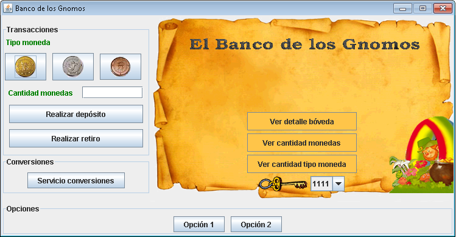

# Enunciado

Un banco de Gnomos desea una aplicación que administre las funciones básicas del banco.
Este banco se caracteriza por el manejo de bóvedas para salvaguardar los tesoros de
monedas de sus clientes, los gnomos. Para cada bóveda, se conoce: nombre, nombre del
cliente que la posee, llave (código numérico) y un tipo (puede ser primario, secundario
o terciario).  El tipo de bóveda implica ciertas restricciones sobre la cantidad máxima
y mínima de monedas que esta puede almacenar:

Una bóveda de tipo primario no tiene restricciones sobre la cantidad de monedas a
almacenar.  
Una bóveda de tipo secundario puede almacenar entre 50 y 2000 monedas.  
Una bóveda de tipo terciario puede almacenar entre 100 y 1000 monedas.  
 
En estas bóvedas es posible depositar tres tipos de monedas: galeones
(monedas de oro), sicklets (monedas de plata) y knuts (monedas de bronce). 

Adicionalmente, el banco presta un servicio de conversión entre estos tres tipos
de monedas basado en las siguientes reglas: 

Un galeón equivale a 14 sicklets.
Un sicklet equivale a 35 knuts.
Un galeón equivale a 490 knuts. 

Se espera que la aplicación permita:

1. Depositar monedas de cualquier tipo (galeones, sicklets o knuts) en una bóveda
dada. El depósito está sujeto a las condiciones de almacenamiento de la bóveda.
2. Retirar monedas de cualquier tipo (galeones, sicklets o knuts) de una bóveda dada.
El retiro está sujeto a las condiciones de almacenamiento de la bóveda.
3. Ver la cantidad total de monedas almacenadas en una bóveda dada.
4. Ver la cantidad de monedas de un tipo (galeones, sicklets o knuts) almacenadas en
una bóveda dada.
5. Ver la información básica asociada a una bóveda dada. 
6. Realizar conversión entre los tipos de monedas del banco.

# Interfaz

